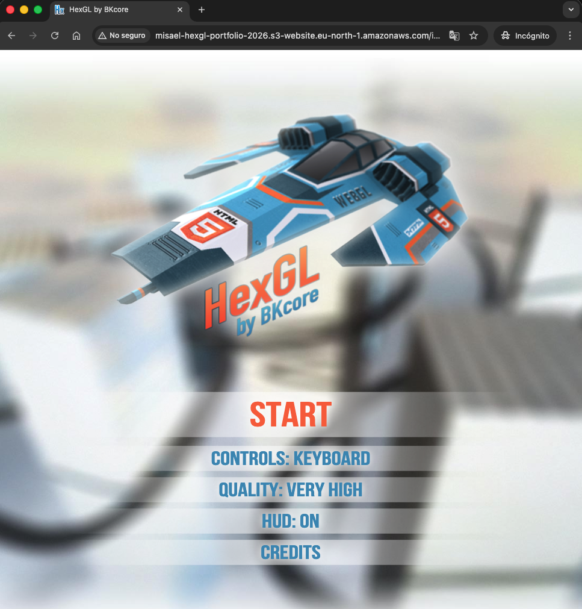

# HexGL: Cloud Infrastructure & Deployment 🏎️💨

A professional deployment of the HexGL WebGL racing game, showcasing Infrastructure as Code (IaC), containerization, and cloud hosting best practices.

## 🌐 Live Demo
**Play the game here:** [HexGL on AWS S3](http://misael-hexgl-portfolio-2026.s3-website.eu-north-1.amazonaws.com)

---

## 📸 Preview


---

## 🛠️ Tech Stack & Skills
* **Cloud Provider:** AWS (S3 for Static Web Hosting)
* **Infrastructure as Code:** Terraform
* **Containerization:** Docker (Nginx-based)
* **CI/CD & CLI:** AWS CLI, Git, Linux Bash

## 🏗️ Architecture Overview
The project follows a modern cloud workflow:
1.  **Local Development:** The application is containerized using Docker for consistent local testing.
2.  **IaC Provisioning:** Terraform manages the S3 bucket, public access blocks, and bucket policies.
3.  **Deployment:** Assets are synchronized to the cloud using the AWS CLI.

---

## 🚀 How to Run this Project

### Local (Docker)
1. Build the image:
   ```bash
   docker build -t hexgl-game .
Run the container:

Bash
docker run -d -p 8080:80 hexgl-game
Access at http://localhost:8080.

Cloud (Terraform)
Initialize Terraform:

Bash
cd terraform
terraform init
Deploy Infrastructure:

Bash
terraform plan -out=main.tfplan
terraform apply "main.tfplan"
💡 Lessons Learned & Troubleshooting
1. Terraform Race Conditions
Problem: Encountered a 403 Forbidden error during deployment because the S3 Bucket Policy was attempting to apply before the PublicAccessBlock had finished updating.
Solution: Implemented an explicit depends_on block in Terraform to ensure the correct sequence of resource creation.

2. AWS CLI Authentication Issues
Problem: Legacy SSO session conflicts caused AuthorizationHeaderMalformed errors.
Solution: Debugged the AWS CLI credential precedence and utilized temporary Environment Variables to bypass corrupted profiles and ensure a clean deployment to the eu-north-1 region.

3. Static Web Hosting Configuration
Configured S3 with specific Index Document rules to ensure seamless routing for the WebGL assets and the main entry point (index.html).


HexGL
=========

Source code of [HexGL](http://hexgl.bkcore.com), the futuristic HTML5 racing game by [Thibaut Despoulain](http://bkcore.com)

## Branches
  * **[Master](https://github.com/BKcore/HexGL)** - Public release (stable).

## License

Unless specified in the file, HexGL's code and resources are now licensed under the *MIT License*.

## Installation

	cd ~/
	git clone git://github.com/BKcore/HexGL.git
	cd HexGL
	python -m SimpleHTTPServer
	chromium index.html

To use full size textures, swap the two textures/ and textures.full/ directories.

## Note

The development of HexGL is in a hiatus for now until I find some time and interest to work on it again.
That said, feel free to post issues, patches, or anything to make the game better and I'll gladly review and merge them.
